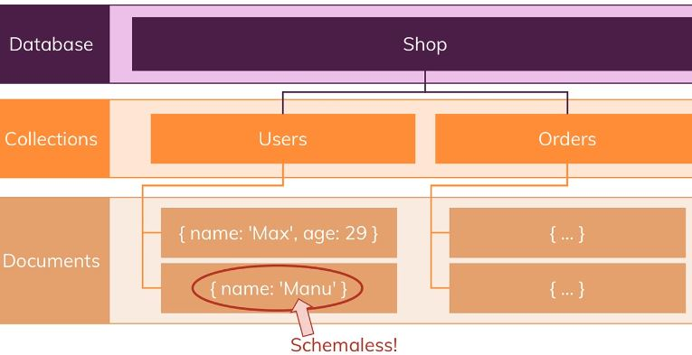

= MongoDb : Introduction

*MongoDb* est une solution de base de données que l'on peut utiliser dans n'importe quel projet que l'on souhaite construire : Une __application mobile__, un site Web, une __application de bureau__ ou encore si vous travaillez en tant que __data scientist__. 

Si vous souhaitez stocker des données rapidement et efficacement sans vous soucier de la configuration, de la structures de données, alors MongoDb est adapté avec cette approche. 

Nous allons voir dans ce cours tout ce qu'un développeur a besoin de savoir pour utiliser efficacement MongoDB : 

* Comment configurer MongoDb. 
* Comment structurer vos données. 
* Comment représenter les relations. 
* Comment effectuer des opérations CRUD efficaces et puissantes. 

Ce cours a une approche pratique mais il y aura de la théorie également. 

== Qu'est ce que MongoDB

MongoDB est une base de données développée par une entreprise qui se nomme aussi MongoDB et qui exploite d'autres produits également. Toutefois, lorsque nous parlerons de MongoDB nous désignerons le produit  MongoDB. 
Le nom vient de l'anglais `humongous ` qui peut se traduire par "énorme", parce que nous pouvons stocker des données très volumineuses et en nombres. 

Il existe d'autres systèmes permettant de gérer des données comme MySQL ou PostGres et bien d'autres. En quoi MongoDb est-il différent des autres ? 

Dans une base de données comme MySQL nous avons une ou plusieurs base de données qui peut contenir plusieurs tables. Dans MongoDB, nous avons aussi plusieurs base de données, mais qui sont constituées de collections. 

Ainsi dans la BDD d'une boutique en ligne, nous pourrions avoir des utilisateurs et une collection de commandes, une collection de produits par exemple. 

A l'intérieur des collections nous trouvons des documents qui ressemblent à des objets Javascript et qui sont au format : `JSON`.
Et ce qu'il y a de remarquable c'est que ces documents sont "schemaless", c'est à dire sans schéma. 
Par exemple : 

Comme les documents sont écrits au format JSON cela nous permet de créer des relations complexes entre les données et de les stocker dans un seul et même fichier, ce qui rend leur exploitation extrêmement efficaces. 
En SQL, il faudrait créer plusieurs tables différentes et écrire des requêtes avec des jointures complexes pour récupérer les données. 

Toutefois, dans MONGODB, le format n'est pas tout à fait du JSON mais du BSON. 
Le BSON est du JSON converti par MONGODB en format binaire. Cela permet au système de stocker et d'interroger plus efficacement les données. Mais cette étape est automatiquement géré par MONGODB. 

Voici un exemple de fichier JSON : 

[,json]
----
{
  "name" : "Baptiste",
  "age" : 39, 
  "address" : {
    "city" : "Paris"
  },
  "hobbies" : [
    {"name": "sports"},
    {"name": "randonnée"}
  ]

}
----

La puissance de MongoDB réside dans le fait de pouvoir interroger les données au format dont nous avons besoin au lieu d'exécuter des restructurations complexes sur le serveur. 

== Caractéristiques clés de MongoDB.

MongoDb est une solution NoSQL car elle suit fondamentalement un concept, une philosophie opposée à celle de toutes les bases de données basées sur SQL. Au lieu de normaliser les données, ce qui signifie les stocker, les distribuer sur plusieurs tables qui possèdent un schéma clair contenant beaucoup de relations., au lieu de cela, MongoDb opte pour le stockage des données, ensemble dans un document, sans schéma. Ainsi, si nous avons plusieurs documents dans une même collection, ils peuvent avoir des structures différentes. 
Cela peut conduire à des données en désordre mais c'est toujours votre responsabilité en tant que développeur de travailler avec des données propres et de mettre en oeuvre une solution qui fonctionne. Mais d'un autre côté, cela vous donne beaucoup de fléxibilité. 

Vous pouvez utiliser mongodb pour des applications qui pourraient encore évoluer, où les exigences de données exactes ne sont pas encore définies, vous pouvez commencer et vous pouvez toujours ajouter des données avec plus d'informations dans une collection de la même collection 
à un moment ultérieur.

Une chose essentielle de mongodb est que vous avez moins de tables, donc moins de collections que vous liez. Mais au lieu de cela vous stockez des données ensemble.
Étant donné que les données sont stockées ensemble, lorsque votre application récupère des données, elle n'a pas besoin d'atteindre la collection A, de la fusionner avec la collection B, de la fusionner avec la collection C,non,  au lieu de cela, elle va à la collection A, puis mongodb a un mécanisme en arrière-plan qui parcours toutes les données très rapidement lors de la recherche d'un document spécifique. Puis il trouvera ce document et il n'y a pas besoin de fusionner la plupart des temps.
C'est donc vraiment de là que viennent la vitesse, les performances et la flexibilité de MongoDB. C'est aussi pourquoi les solutions noSQL sont très populaires.

== L'Ecosystème de MongoDB

L'actif principal est MongoDB Database. 

image::img/img2.PNG[]

== Installation sous windows

Sur le site MongoDb.com => Software => Community Server. ( version gratuite de MongoDB).

Compass est une interface graphique pour intéragir avec MongoDB comme PHPMYADMIN pour MySQL. 

Installation "personnalisée/custom" et assurons nous que les items : Client / Serveur soient tous sélectionnés. 
Sous Windows MongoDb peut être installé comme un service. 

Les dossiers : Data Directory et Log Directory sont définis par défaut .Expliquons ce qu'ils font : Les fichiers de la base de données sont stockés dans notre système. 
Et par défaut : 

``C:\Program Files\MongoDB\Server\5.0\data\``

C'est dans ce répertoire que seront stockées les fichiers de la base de données. 

Maintenant que l'installation est réalisé. Nous pouvons aller dans les services Windows et chercher celui nommé : "MongoDB Server" et assurez vous qu'il est démarré. 

En ligne de commande : 

``net stop MongoDb`` ou ``net start MongoDb`

Le client console : 

``C:\Program Files\MongoDB\Server\5.0\bin\mongodb.exe`` 

la commande ``show dbs`` pour lister les bdd

== MongoDb Shell

Le Shell intéractif propose une interface vers MongoDb qui offre aux administrateurs système ou aux développeurs la possibilité de tester des requêtes et opérations directement avec la base de données. 

Téléchargeons ce nouveau Shell écrit en Javascript . 
https://www.mongodb.com/try/download/shell

L'exécutable : mongogosh

== Installation de mongoimport

Il existe un outil qui se nomme : mongoimport qui est une commande/outil local qui peut être utilisé pour importer des données déjà préparées dans MongoDB. 

https://www.mongodb.com/docs/database-tools/installation/installation-windows/#installation

== Démarrons ! 

[,json]
----
  show dbs
  use shop
  db.products.insertOne({name: "Lord of Rings", price: 12.99})
  db.products.find()
  db.products.find().pretty()
  cls
----

== Shell vs Drivers 

Lorsque nous développons une application, nous avons besoin de connecter notre application à MongoDB. Cela se fait grâce à un Driver. ( voir documentation)

== MongoDB + Clients

image::img/img5.JPG[]

