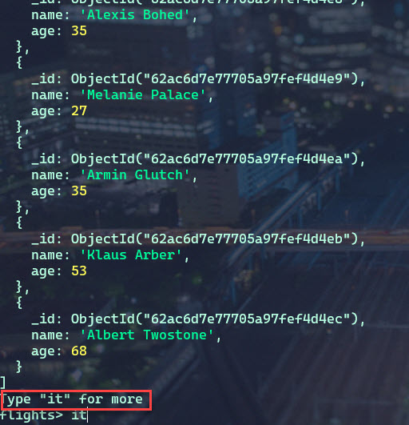

= Comprendre les bases et les opérations CRUD

== Comprendre les bases de données, les collections et les documents.

Nous avons plusieurs plusieurs bases de données, qui contiennent une ou plusieurs Collections. Dans les Collections nous avons des Documents. Les Documents et les Collections sont implicitements créés par MongoDB.

Comment pouvons nous stocker les données et de quel type sont-elles ?

== Création des DataBases et des Collections

Pour choisir une base de données ou la créer si elle n'existe pas encore. 

[,json]
----
use flights
----

Pour voir la liste des DB : 

[,json]
----
show dbs
----

De la même manière, les collections sont automatiquements créées si elles sont sollicitées alors qu'elles n'existent pas. 
Pour créer un document, nous devons le passer en argument à une méthode ``insertOne`` par exemple, au format JSON.

[,json]
----
db.flightData.insertOne({})
----

== Le format JSON

[source,json]
----
include::json/01-flights.json[]
----

Pour ajouter un vol par exemple : 

[,json]
----
db.flightData.insertOne({
    "departureAirport": "MUC",
    "arrivalAirport": "SFO",
    "aircraft": "Airbus A380",
    "distance": 12000,
    "intercontinental": true
  })
----

On constate que MongoDb fourni automatiquement un ID unique à chaque élément inséré dans un document. Le type de cet ID est : ``ObjectId``

*Précisions sur l'objet ObjectId*

Il est codé sur 12 octets :

* 4 octets représentant le timestamp courant (nombre de secondes depuis epoch, naissance d'UNIX).
* 3 octets pour idenfitication de la machine.
* 2 octets pour représenter l’identifiant du processus.
* 3 octets qui représentent un compteur qui démarre à un numéro aléatoire.

== Comparaison JSON et BSON

MongoDb converti les JSON en BSON afin d'améliorer les performances en lecture et écriture. 
Le format ``ObjectId()`` n'est pas un type valide en JSON mais en BSON.

Rappelons que les documents issus d'une même collection n'ont pas à avoir le même schéma. 
Nous devons juste nous assurer que les documents possèdent un unique ``_id`` lorsque nous le définissions nous même (les identifiants peuvent être de type "string", "int").

== Opérations CRUD : CREATE, READ, UPDATE, DELETE

== CRUD : Mise en pratique

Nous avons des données dans la collection flightData, pour en supprimer, nous pouvons utiliser la commande ``deleteOne`` ou ``deleteMany``.

[,json]
----
db.flightData.deleteOne({departureAirport: "TXL"})
----

Nous pouvons utiliser tout les champs composants notre document comme filtre.

Nous pouvons également ajouter de nouveaux champs à un document : 

[,json]
----
db.flightData.updateOne({distance: 12000}, {$set: {marker: "delete"}})
----

Le mot clé ``$set:`` permet de dire à MongoDb d'ajouter cette valeur dans le document sélectionné. 

Ajoutons ce marqueur à tout nos documents : 

[,json]
----
db.flightData.updateMany({}, {$set: {marker: "toDelete"}})
----

Et enfin pour supprimer tout nos documents : 

[,json]
----
db.flightData.deleteMany({})
db.flightData.deleteMany({marker: "toDelete"})
----

== CRUD : InsertMany

[,json]
----
db.flightData.insertMany([
  {
    "departureAirport": "MUC",
    "arrivalAirport": "SFO",
    "aircraft": "Airbus A380",
    "distance": 12000,
    "intercontinental": true
  },
  {
    "departureAirport": "LHR",
    "arrivalAirport": "TXL",
    "aircraft": "Airbus A320",
    "distance": 950,
    "intercontinental": false
  }
])
----

== CRUD : Trouver des données

[,json]
----
db.flightData.find({intercontinental: true}).pretty()
db.flightData.find({distance: 12000}).pretty()
db.flightData.find({distance: {$gt:2000}}).pretty()
----

* *$gt* Greater Than
* *$lt* Lower Than
* *$gte* Greater or Equal To
* *$lte* Lower or Equal To

== CRUD : D'autres filtres pour trouver des données
[, javascript]
----
// différent de
$ne
"number" : {"$ne" : 10}

// fait partie de ...
$in, $nin
"notes" : {"$in" : [10, 12, 15, 18] }
"notes" : {"$nin" : [10, 12, 15, 18] }

// Ou
$or
"$or" : [
  { "notes" : { "$gt" : 10 } },
  { "notes" : { "$lt" : 5  } }
]
// and
$and
"$and" : [
  { "notes" : { "$gt" : 10 } },
  { "notes" : { "$lt" : 5  } }
]

// négation
$not
"notes" : {"$not" : {"$lt" : 10} }

// existe
$exists
"notes" : {"$exists" : true}

// tous les documents qui possède(nt) la propriété level
db.inventory.find( { level : { $exists: true } } )

// tous les documents qui ne possède(nt) pas la propriété level
db.inventory.find( { level : { $exists: false } } )

// test sur la taille d'une liste
$size
"notes" : {"$size" : 4}

// element match

/*
{
    "content" : [
        { "name" : <string>, year: <number>, by: <string> }
        ...
    ]
}
*/

{ "content": { $elemMatch: { "name": "Turing Award", "year": { $gt: 1980 } } } }

// recherche avec une Regex simple
$regex
{ "name": /^A/  }

----

== Notion sur les Regex

Regex signifie en réalité Regular Expressions. Mais c'est un mot issu d'une fusion d'autres mots dont Regular Expressions en fait parti.

Les expressions rationnelles (regex) sont issues de la théorie des mathématiques et spécialementdes des langages formels définies dans les années 1940. Le regex ont la capacité à décrire avec concision des ensembles réguliers ou pattern.

Le standard POSIX a permi de normaliser la syntaxe et fonctionnalités des différents éditeurs de Regex.

Vous trouverez une librairie PCRE (Perl Compatible Regex) implémentée dans de nombreux langages comme dans Mongo et JS par exemple.

Pour utiliser une Regex complexe avec Mongo il faudra utiliser la syntaxe suivante :

``{ <field>: { $regex: /pattern/, $options: '<options>' } }``

== CRUD : Modifier des données

[,json]
----
db.flightData.updateOne({_id_: ObjectId('<ID>')}, {$set:{delayed:true}})
db.flightData.replaceOne({_id_: ObjectId('<ID>')},  {
    "departureAirport": "LHR",
    "arrivalAirport": "TXL",
    "aircraft": "Airbus A320",
    "distance": 950,
    "intercontinental": false
  })
----

== CRUD : find() et l'objet Cursor

[source,json]
----
db.passengers.insertMany([ { "name": "Max Schwarzmueller", "age": 29 }, { "name": "Manu Lorenz", "age": 30 }, { "name": "Chris Hayton", "age": 35 }, { "name": "Sandeep Kumar", "age": 28 }, { "name": "Maria Jones", "age": 30 }, { "name": "Alexandra Maier", "age": 27 }, { "name": "Dr. Phil Evans", "age": 47 }, { "name": "Sandra Brugge", "age": 33 }, { "name": "Elisabeth Mayr", "age": 29 }, { "name": "Frank Cube", "age": 41 }, { "name": "Karandeep Alun", "age": 48 }, { "name": "Michaela Drayer", "age": 39 }, { "name": "Bernd Hoftstadt", "age": 22 }, { "name": "Scott Tolib", "age": 44 }, { "name": "Freddy Melver", "age": 41 }, { "name": "Alexis Bohed", "age": 35 }, { "name": "Melanie Palace", "age": 27 }, { "name": "Armin Glutch", "age": 35 }, { "name": "Klaus Arber", "age": 53 }, { "name": "Albert Twostone", "age": 68 }, {
 "name": "Gordon Black", "age": 38 }])
----

Si nous faisons une recherche de l'ensemble des passagers nous constatons que le shell n'affiche pas toute la liste. Pour voir la suite, il faudra taper la commande ``it``.

La méthode ``find()`` ne donne pas l'ensemble des données mais retourne un curseur vers un ensemble limité de données. C'est pour cela que la méthode ``pretty()`` ne fonctionne pas avec ``find()``.

Pour avoir l'ensemble des données sous forme de tableau, il faudra convertir l'objet ``Cursor`` en ``Array``. 

[source,json]
----
db.passengers.find().toArray()
----

Nous pouvons également utiliser une fonction Javascript avec ce Shell basé sur Javascript pour traiter chaque ligne retournée. 

[source,bson]
----
db.passengers.find().forEach((passenger) => {printjson(passenger)})
----

* Utilisation d'un curseur pour lire le document :
[, javascript]
----
const resCursor1 = db.restaurants.find();

while (resCursor1.hasNext()) {
  print(tojson(resCursor1.next()));
}

// n'affichera rien car il n'y a plus rien dans la pile elle a été vidé dans la première boucle
while (resCursor1.hasNext()) {
  print(tojson(resCursor1.next()));
}
----

== Projection

Actuellement nous recevons l'intégralité du contenu d'un document. Mais l'on peut seulement avoir besoin que d'un seul champ par exemple. Et pour des raisons d'optimisation de la bande passante, il est préférable de ne récupérer uniquement que les données nécessaires. 

C'est donc là qu'intervient le concept de *projection*. Qui permet de filtrer les champs du document retourné. 

[source,bson]
----
db.passengers.find({}, {name: 1})  <1>
db.passengers.find({}, {name: 1, _id: 0})  <2>
----

<1> La valeur "1" doit être assigner au nom du champ à retourner. 

<2> La valeur "0" doit être assigner pour exclure un champ mais par défaut tout les champs sont à la valeur 0 quand on utilise un projection.

[NOTE] 
.Le champ ``_id``
====
Le champ ``_id`` est un champ particulier qui sera toujours inclus. 
====

== Documents embarqués

Les documents embarqués sont des documents qui sont contenus dans un autre document. En JSON, nous pourrions dire qu'il s'agit d'un champ de type Objet ou un champ tableau contenant des Objets. 

Nous pouvons alors concevoir des sous-documents, qui eux-même pourrons contenir des documents et ainsi de suite. 

La seule limite est la taille maximale que peuvent avoir les documents MongoDb : *60MO*. On peut penser que cela est peu, mais rappelons que ce n'est que du texte que l'on stocke. Pas des images ou autre. 

== Documents embarqués : Exemple

[source,bson]
----
db.passengers.updateMany({}, {$set: {status: {description: "on-time", lastUpdated: "1 hour ago"}}})  
----

[source,bson]
----
db.passengers.updateMany({}, {$set: {status: {description: "on-time", lastUpdated: "1 hour ago", details: {responsible: "Bauer Baptiste"}}}})  
----

== Les tableaux

[source,bson]
----
db.passengers.updateOne({name: "Albert Twostone"}, {$set: {hobbies:["sports", "cooking"]}})  
----

== Accèder aux données structurées

[source,bson]
----
db.passengers.findOne({name: "Albert Twostone"}).hobbies <1>
db.passengers.find({hobbies:"sports"}) <2>
db.passengers.find({"status.description" : "on-time"}) <2>
----

<1> Retourne la liste des hobbies de Albert Twostone.
<2> Retourne l'ensemble des passagers qui ont "sports" comme hobby.
MongoDb est suffisament intelligent pour voir que ``hobbies`` est un tableau et va donc chercher l'entrée *sports* dedans. 

== Exercices

=== 01 - Analyser une requête

* Analysez la requête suivante sans l'exécuter dans MongoDB. Et expliquez ce qu'elle récupère.

Voici un exemple de condition logique en utilisant ``OR`` et ``AND``. Remarquez le deuxième argument de la méthode ``find``, il permet de faire une projection, c'est-à-dire de sélectionner uniquement certaine(s) propriété(s) du document :

[source,javascript]
----
db.restaurants.find(
  {
    borough: "Brooklyn",
    $or: [{ name: /^B/ }, { name: /^W/ }],
  },
  { name: 1, borough: 1 }
);
----

* Traduire cette requête en SQL

=== 02 - Exercice compter le nombre de restaurants

Sans utiliser la méthode count dans un premier temps comptez le nombre de restaurants dans le quartier de Brooklyn. en Javascript.

Indications : pour itérer sur une requête vous utiliserez l'une des deux syntaxes suivantes :

[source, javascript]
----
// 1
let count = 0;
db.collection.find().forEach((doc) => console.log(doc));

// 2
let count = 0;
const myCursor = db.users.find(restriction);
while (myCursor.hasNext()) {
  myCursor.next();
}
----

Puis comparez le résultat avec la méthode count :

[source, javascript]
----
db.collection.findOne(query, restriction).count();
----

=== 03 - liste

*  Combien y a t il de restaurants qui font de la cuisine italienne et qui ont eu un score de 10 au moins ?

__Affichez également le nom, les scores et les coordonnées GPS de ces restaurants. Ordonnez les résultats par ordre décroissant sur les noms des restaurants.__

Remarque pour la dernière partie de la question utilisez la méthode sort :
[source, javascript]
----
db.collection.findOne(query, restriction).sort({ key: 1 }); // 1 pour ordre croissant et -1 pour décroissant
----

* Quels sont les restaurants qui ont eu un grade A et un score supérieur ou égal à 20 ? Affichez uniquement les noms et ordonnez les par ordre décroissant. Affichez le nombre de résultat.

__Remarque pour la dernière partie de la question utilisez la méthode count :__
[source, javascript]
----
db.collection.findOne(query, restriction).count();
----

* A l'aide de la méthode distinct trouvez tous les quartiers distincts de NY.

[source, javascript]
----
db.restaurants.distinct("borough");
----

* Trouvez tous les types de restaurants dans le quartiers du Bronx. Vous pouvez là encore utiliser distinct et un deuxième paramètre pour préciser sur quel ensemble vous voulez appliquer cette close :

[source, javascript]
----
db.restaurants.distinct("field", { key: "value" });
----

* Trouvez tous les restaurants dans le quartier du Bronx qui ont eu 4 grades

* Sélectionnez les restaurants dont le grade est A ou B dans le Bronx.

* Même question mais, on aimerait récupérer les restaurants qui ont eu à la dernière inspection (elle apparaît théoriquement en premier dans la liste des grades) un A ou B. Vous pouvez utilisez la notion d'indice sur la clé grade :

[source, javascript]
----
"grades.2.grade";
----

* Sélectionnez maintenant tous les restaurants qui ont le mot "Coffee" ou "coffee" dans la propriété name du document. Puis, même question mais uniquement dans le quartier du Bronx.

__Comptez également leurs nombres total et calculez la différences avec Coffee et coffee. Utilisez une Regex :__

[source, javascript]
----
/[aA]lan/
----

* Trouvez tous les restaurants avec les mots Coffee ou Restaurant et qui ne contiennent pas le mot Starbucks. Puis, même question mais uniquement dans le quartier du Bronx.

* Trouvez tous les restaurants qui ont dans leur nom le mot clé coffee, qui sont dans le bronx ou dans Brooklyn, qui ont eu exactement 4 appréciations (grades).

* Reprenez la question 11 et affichez tous les noms de ces restaurants en majuscule avec leur dernière date et permière date d'évaluation.

=== 04- Recherche de restaurants à proximité d'un lieu

MongoDB permet de gérér des points GPS. Dans la collection restaurants nous avons un champ address.coord qui correspond à des coordonnées GPS (longitude & latitude).

Nous allons utiliser les coordonnées sphériques de MongoDB. Pour l'implémenter dans la collection vous devez créer un index particulier sur le champ coord :

[source, javascript]
----
db.restaurants.createIndex({ "address.coord": "2dsphere" });
----

=== 05-  Exercice GPS

Après avoir créer l'index 2dsphere ci-dessus, trouvez tous les restaurants qui sont à 5 miles autour du point GPS suivant, donnez leurs noms, leur quartier ainsi que les coordonnées GPS en console, aidez-vous des indications ci-après :

[source, javascript]
----
const coordinate = [-73.961704, 40.662942];
----

Indications : vous utiliserez la syntaxe suivante avec les opérateurs MongoDB :

[source, javascript]
----
// opérateur
{ $nearSphere: { $geometry: { type: "Point", coordinates: coordinate }, $maxDistance: VOTRE_DISTANCE_EN_METRE } }
----

=== 06-  Exercice Recherche par rapport à la date (répondre sans coder)

Sans exécutez la requête suivante, qu'affiche-t-elle ?

[source, javascript]
----
db.restaurants.find(
  {
    "grades.0.date": ISODate("2013-12-30T00:00:00Z"),
  },
  { _id: 0, name: 1, borough: 1, "grades.date": 1 }
);
----

=== 07-  Exercices supplémentaires

* Affichez la liste des restaurants dont le nom commence et se termine par une voyelle.
* Affichez la liste des restaurants dont le nom commence et se termine par une même lettre.

Remarque vous pouvez soit programmer cet affichage, soit directement utiliser une regex. Dans ce cas lisez les indications suivantes :
[source, javascript]
----
() // les parenthèses captures une chaîne de caractère(s)
\1 // permet de récupérer la première chaîne de caractère(s) capturée(s)
\2 // permet de récupérer la deuxième chaîne de caractère(s) capturée(s)
----

=== 08- : Données du patient  

Durée : 30 min

Vous travaillez pour un hôpital et voici la structure de données que nous obtenons pour un patient : 

[,txt]
----
{
  "firstname" : "John",
  "lastname" : "Doe",
  "age" : 29,
  "history" : [
    {
      "disease": "cold",
      "treatment" : "Antibiotics"
      ...
    }
    {
      ....
    }
  ]
}
----

* Insérer 3 nouveaux patients avec au moins une donnée dans le champ ``history``.
* Modifier un patient avec un nouvel âge, nouveau nom et une nouvelle entrée dans l'historique. 
* Trouver tout les patients qui sont plus vieux que 30 ans ( ou tout autre valeur de votre choix)
* Supprimer tout les patients qui ont eu comme maladie : "cold" ( ou tout autre maladie)

[NOTE] 
.DataBases, Collections, Documents
==== 
. Une Database contient des collections.
. Une collection contient des documents
. Les Database et les Collections sont créées à la volée, quand un document est inséré.
. Un document ne peut pas être insérer dans une Database, il doit l'être dans une collection.
====

[NOTE] 
.Structure des Documents
==== 
. Chaque Document à besoin d'un identifiant unique et en reçois un par défaut.
. Nous pouvons avoir des documents imbriqués dans d'autres documents ainsi que des tableaux.
====

[NOTE] 
.Opérations CRUD
==== 
. MongoDB permet d'effectuer des multiples opérations CRUD sur des documents uniques ou de masse. 
. La méthode ``find()`` retourne un curseur et PAS une liste de documents.
. Les filtres permettent de trouver des documents spécifiques. 
====

[NOTE] 
.Récupération des données
==== 
. Utilisez les filtres et les opérateurs pour limiter le nombre de documents retourné.
. Utilisez les projections pour limiter les champs retournés. 
====