= Schémas et relations : Comment struturer les documents

[IMPORTANT] 
.Nettoyer votre base de données.
==== 
Nous allons régulièrement nettoyer la base de données dans cette section. C'est à dire que nous allons la purger de ses données.

Pour cela : 

. Charger la base de données à supprimer : ``use databaseName`` et lancer la commande ``db.dropDatabase()``.
. De façon analogue, nous pouvons supprimer une collection : ``db.myCollection.drop()``.
====

== Introduction

Maintenant que vous savez comment vous pouvez essentiellement insérer des données, lire des données et ainsi de suite et que vous avez également vu comment vous pouvez explorer vos données, prenons un peu de recul.

Commençons au début de tout projet où vous devrez vous posez ces questions : 
* Comment modélisez les données?
* Comment stocker les données dans la base de données?
* Quelles relations existent entre les données?
* Comment ces relations devraient-elles se refléter dans votre base de données?

Ce sont toutes des questions importantes et ces questions auront un impact sur la façon dont vous utilisez mongodb et la façon dont vous structurez vos données.

Par conséquent, dans cette section , nous allons examiner les schémas de documents et nous verrons comment en créer.
Nous allons également jeter un coup d'œil aux types de données importants que mongodb vous offre parce que les types comme les chaines de caractères, les nombres mais aussi certains types avancés comme les dates sont bien sûr cruciaux pour vous permettre de stocker exactement les données dont votre application. Cependant, nous ne nous arrêterons pas à ces types de données dans le schéma général du document, nous examinerons également les relations entre les documents ou vos données, car dans la plupart des applications, vous avez différentes entités.

Lorsque vous créez un blog, vous avez des articles, vous avez des utilisateurs, vous avez des commentaires et toutes ces entités sont liées et ces relations doivent également être reflétées dans votre base de données et vous verrez comment cela fonctionne dans mongodb dans ce module aussi.

Nous verrons également comment valider les données entrantes.
Par exemple, si l'âge d'un utilisateur est vraiment un nombre.

== Pourquoi utiliser des schémas ? 

Même MongoDb ne force pas à l'utilisation de schéma mais dans la réalité c'est mieux d'en prévoir surtout sur de gros projet afin de structurer sa base de données pour travailler plus efficacement.
Par exemple dans une boutique en ligne, c'est plus judicieux de rendre nécessaire d'avoir un champ "price".

== Structure de Documents

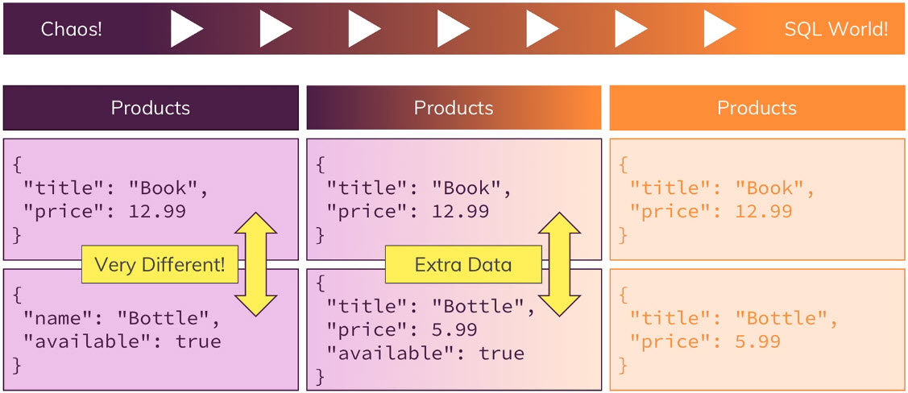

* Approche médiane : 

[source, javascript]
----
db.products.insertOne({name: "A book", price: 12.99})
db.products.insertOne({name: "A T-Shirt", price: 20.99})
db.products.insertOne({name: "A Computer", price: 1299, details:{cpu: "Intel I9 1200KL"} })
----

Nous constatons que nos produits ont tous des champs en commun : le ``name``, le ``price``, mais que l'ordinateur, lui, possède en plus un champ ``details``.
Avec une approche "SQL", le livre et le T-Shirt aurait dû avoir un champ ``details`` initialisé à la valeur ``null``. 

* Approche SQL : 

[source, javascript]
----
db.products.insertOne({name: "A book", price: 12.99, details:null})
db.products.insertOne({name: "A T-Shirt", price: 20.99, details:null})
db.products.insertOne({name: "A Computer", price: 1299, details:{cpu: "Intel I9 1200KL"} })
----

Cette approche permet plus de clarté dans l'utilisation de notre base de données même si MongoDB permet de faire comme l'on souhaite. 

== Types de données

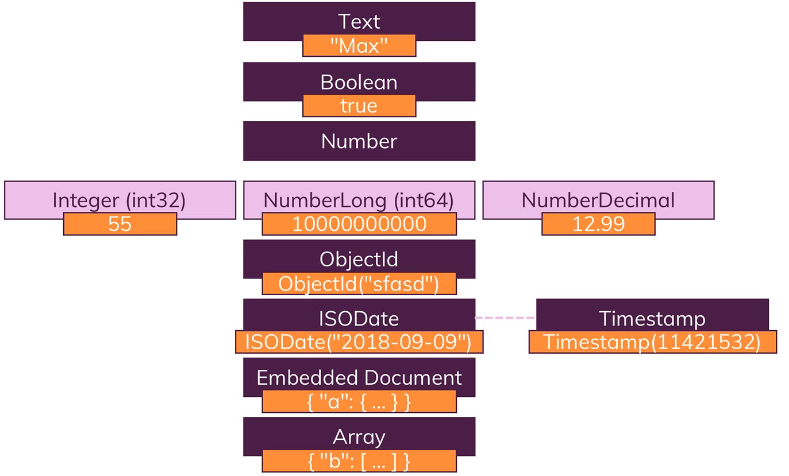

* Le type ``Text``, qui s'utilise en mettant les données entre guillemets. Limité à 16Mo.
* le type ``Booléen``.
* le type ``Number`` composé des types : ``Integer(int32)``, ``NumberLong(int64)``, ``NumberDecimal``. MongoDb possède un type spéciale pour les nombres décimaux, car les valeurs normales en virgule flottante, appelées ``double``, sont arrondis, et donc pas super précises. Pour de nombreuxcas d'utilisation cela est suffisant(prix dans une boutique) mais pour des calculs scientifiques, il fuadra utiliser un type spécial qui permet 34 décimales.  
* Le type ``objectId``, généré automatiquement par MongoDB pour garantir l'unicité des documents. 
* Le type `ISODATE` qui permet de faire des calculs sur les dates. 
* Le type ``Timestamp``.
* Le type ``Document embarqué``.
* Le type ``Tableaux``.

== Types de données en Action

[source, javascript]
----
use companyData
db.companies.insertOne({name: "Fresh Apples Inc", isStartup: true, employees:33, funding: 123456789123456789, details: {ceo: "John Doe"}, tags: ["super", "perfect"], foundingDate: new Date(), insertedAt: new Timestamp()})
----

La génération des types dépend du driver utilisé par votre application. 

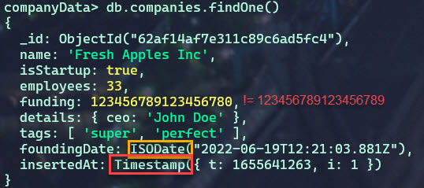

Si l'on souhaite stocker un nombre extrêmement grand, et garder son intégrité, il faudra surement le stocker en chaîne de caractère. 

* db.stats()

Permet de voir la taille des objects stockés.  

testons avec 

[source, javascript]
----
db.numbers.insertOne({a:  1})
db.numbers.insertOne({a:  NumberInt(1)})
----

*Conclusion* : La méthode ``NumberInt`` permet de gérer la taille des données plus efficacement. Et c'est une raison de plus pour utiliser les types spéciaux fournis par MongoDB. 
Il convient de souligner que cela n'a été stocké que sous forme de nombre à virgule flottante 64bits parce que le shell est basé sur javascript, et javascript ne fait pas de différence entre les nombres entiers et les flottants. 

Nous pouvons vérifier le type avec : ``type of``

== Data Schemas & Data Modelling

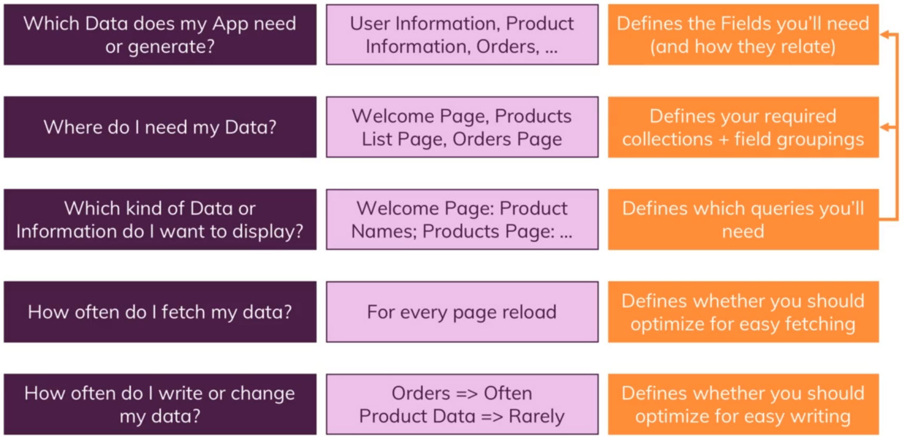

Maintenant que nous comprenons que nous pouvons utiliser le schémas et que nous les utiliserons probablement parce que notre application fonctionne généralement avec certains types de données,voyons comment nous pensons à la modélisation de nos schémas.

Nous ne regarderons pas encore les relations.

Et une question importante est de savoir quelles données mon application a besoin ou doit générer et le terme application doit certainement être compris dans un sens très large ici, cela peut être une application mobile, cela peut être un site Web, ce pourrait être un appareil intelligent générant des données comme un tracker, un tracker de fitness envoyant des coordonnées GPS, c'est donc une définition très large de l'application.

Pourriez-vous dire, de quelles données a-t-elle besoin et / ou génère-t-elle? Et cela peut être n'importe quoi, des informations utilisateur, des informations produit, des commandes, des coordonnées. Un utilisateur peut commander des produits, ce sont donc ceux-ci, cela vous donne le cadre général de votre structure de données.

Vous devez également réfléchir à l'endroit où vous aurez besoin de ces données, donc par exemple si vous créez un site Web, en aurez-vous besoin sur la page d'accueil, sur la page de liste des produits, sur la page des commandes et quel type de données.
L'idée avec mongodb est que vous stockez vos données dans le format dont vous avez besoin dans votre application et si vous avez besoin des mêmes données dans différents formats, vous voulez trouver une bonne structure qui couvre tous ces cas d'utilisation ou si cela est absolument nécessaire, vous pouvez même le diviser en plusieurs collections.

Ainsi, cela définit vos collections requises, par exemple que vous avez une collection de commandes pour la page des commandes, que vous avez une collection de produits pour la page des produits.
Cela définit également les champs que vous avez dans les documents d'une collection et comment vous pouvez les regrouper. 

Alors comment vous pourriez vous relier à ces champs ? Vous devez également vous demander quel type de données ou d'informations je souhaite afficher, donc sur ces différentes pages, quel type de données dois-je afficher là-bas, puis définir à nouveau les requêtes dont vous aurez besoin. 

Alors, est-ce que j'affiche une liste de produits ou un seul produit, est-ce une requête ``find`` ou ``findOne``,  comment dois-je configurer cette requête, suis-je à la recherche d'un produit avec un ID spécifique ou suis-je à la recherche de tous les produits.

Les requêtes ou le type de requêtes que vous planifiez ont également un impact sur vos collections et la structure de votre document, car comme je l'ai déjà dit, mongodb embrasse vraiment cette idée de planifier votre structure de données en fonction de la façon dont vous récupérerez vos données, de sorte que vous n'avez pas besoin de faire des jointures complexes mais que vous pouvez récupérer vos données au format ou presque au format dont vous avez besoin dans votre application.

Vous devez également vous demander à quelle fréquence je récupère ces données, à chaque rechargement de page ou à chaque seconde ou pas si fréquement , car cela vous indique également si vous devez optimiser pour une récupération facile.

Donc, ce sont des choses à garder à l'esprit ou à penser et si c'est beaucoup en ce moment, c'est tout à fait normal.

Nous verrons tout cela tout au long du cours et nous aurons de nombreux exemples pour que vous puissiez avoir une idée de la façon dont vous pourriez aborder cela et comment nous structurerions les données dans un certain scénario.

Et une chose importante qui est liée à ces questions est bien sûr la question de la modélisation des relations entre les différentes entités dans vos données.

== Comprendre les relations

Nous pouvons avoir plusieurs collections qui peuvent être liés entre elles. 

Comment schématiser ses relations ? 

* Utilisons nous des documents embarqués dans d'autres ? 

C'est un cas de figure classique que celui d'un carnet d'adresse : vous avez des informations sur un utilisateur, et un champ adresse qui sera un autre document contenant les données de son adresse. 

[source, javascript]
----
{
  userName: 'name',
  age: 29,
  address: {
    street: 'Second Street',
    city: 'New York'
  }
}
----

* Utiliserons nous des références ? 

Nous avons une liste de clients par exemple : 

[source, javascript]
----
{
  userName: 'name',
  favBooks: [{...}, {...}]
}
----

Nous pouvons avoir énormement de données dupliquées, car les clients peuvent avoir le même livre favori. De plus, si une information change concernant le livre favori en question, il faudra rapporter cette modification à l'ensemble des clients l'ayant de sa liste de favori. 

C'est pour cette raison que nous utiliserons les références.

Nous aurons donc : Une collection de clients, et une collection de livre. Et la référence du livre préféré sera son identifiant unique. 

[source, javascript]
----
customers : [{
  userName: 'name',
  favBooks: ['id_1', 'id_2']
}]

books : [{
  _id: 'id_1',
  name: 'Lord of the Rings 1'
}]
----

Il existe donc 2 approches, comment choisir l'une par rapport à l'autre? 

== Relation ONE TO ONE : Embarqué

=== Example : Patient - Dossier Médical

__Un patient possède un dossier médical. Un dossier médical n'appartient qu'à un seul patient.__

Comment modéliser cela ? 

[source, javascript]
----
db.patients.insertOne({name: "Max", age: 29, diseaseSummary: "summary-max-1"})
db.diseaseSummaries.insertOne({_id:"summary-max-1", diseases: ["cold", "broken leg"]})
----

Retourne Max et son identifiant de dossier. 
[source, javascript]
----
db.patients.findOne()
----

Nous souhaitons stocker l'identifiant seul : 

[source, javascript]
----
let dsid = db.patients.findOne().diseaseSummary
----

Nous allons maintenant effectuer une recherche dans les `diseaseSummaries` avec l'identifiant stocké : 

[source, javascript]
----
db.diseaseSummaries.findOne({_id: dsid})
----

Cette manière de faire est efficace et offre le résultat escompté toutefois, si nous avions une collection de dossiers plus volumineuse, nous perdrions en performance. 

Dans cette exemple, séparer les données en 2 collections n'est pas nécessaire puisqu'un patient est associé à un seul dossier. Et qu'un dossier est pareillement associé à un seul patient. 
Afin d'améliorer les performances, il faudra plutôt intégrer dans le document `patients` , un champ, qui sera un document `diseaseSummaries`.

[source, javascript]
----
db.patients.insertOne(.
  {
    name: "Max", 
    age: 29, 
    diseaseSummary: {
      disease:  ["cold", "broken leg"]
    }
  }
)
----

== Relation ONE TO ONE : Référence

=== Example : Person - Car

__Une personne possède une voiture et une voiture appartient à une personne.__

Pour la majorité des relations one-to-one, nous utiliserons un document embarqué. 
Mais on peut envisager toutefois, dans certains cas, de séparer nos données en plusieurs collections. 

Créons ce cas de figure en utilisant dans un premier temps un document embarqué. 

[source, javascript]
----
db.persons.insertOne({name: "Bob", car: {model: "BMW", price: 40000}})
----

Et nous pouvons facilement accèder aux informations de la voiture de Bob. 

[source, javascript]
----
db.persons.findOne()
----

Maintenant, on peut imaginer une application qui doit faire des statistiques sur les voitures, le salaire des propriétaires ..etc
Nous avons donc besoin de séparer nos collections. Parce que je ne veux pas forcement recevoir toutes les informations d'un utilisateur lorsque je vais charger les données des voitures. 

[source, javascript]
----
db.persons.insertOne({name: "Max", age:29, salary:3000})
db.cars.insertOne({model: "BMW", price:40000, ObjectId('Id_de_Max')})
----

== Relation ONE TO MANY : Embarqué
=== Example : Sujet - Réponses

__Un sujet peut recevoir plusieurs réponses et une réponse n'appartient qu'à une seule question__

Imaginons une application qui permet de poser des questions à des utilisateurs qui peut recevoir des réponses d'autres utilisateurs. 

Nous pourrions être tenté d'utiliser une référence : 

[source, javascript]
----
db.questionThreads.insertOne(
  {
    creator: "Max", 
    question:"What is your quest?", 
    answers:
      [
        "q1a1", 
        "q1a2",
        "q1a3",
        "q1a4"
      ]
  }
)

db.answers.insertMany([
  {_id: "q1a1", text: "......"},
  {_id: "q1a2", text: "......"},
  {_id: "q1a3", text: "......"},
  {_id: "q1a4", text: "......"},
  
  ])
----

Nous pouvons récupérer l'ensemble des réponses pour une question donnée. Mais dans ce cas de figure la méthode embarquée semble la plus adéquate pour cette application. Car lorsque nous chargeons une question, nous chargeons également l'ensemble des réponses. 
Et les réponses n'ont de sens qu'avec la question, donc nous n'avons pas envisager la situation où elles seront retournées seules, séparées de la question. 

[source, javascript]
----
db.questionThreads.insertOne(
  {
    creator: "Max", 
    question:"What is your quest?", 
    answers:
      [
        { text: "......"} 
        { text: "......"},
        { text: "......"},
        { text: "......"}
      ]
  }
)
----

== Relation ONE TO MANY : Références
=== Example : Ville - Habitants

__Une ville possède plusieurs habitants, et un habitant possède une seule ville__

On pourrait très bien embarquer dans le document ``City`` l'ensemble des ``Citizens``... mais dans l'optique d'une application plus globale, nous pourrions vouloir seulement charger les métadatas d'une ville, sans la liste de ses habitants. 
Pour des raisons de performance, on comprend qu'une ville comme NY City serait très lourde à charger. Et en plus, la limite de 16MO (taille max d'un document) risque d'être dépassé. 

Donc séparer les données en 2 collections fait sens pour des raisons techniques. 

[source, javascript]
----
db.cities.insertOne({name: "New York", coordinates: {lat: 21, lng: 55}})
db.citizens.insertMany([
  {name: "John Doe", cityId: ObjectId('123456789')},
  {name: "Mark Doe", cityId: ObjectId('123456789')},
  {name: "Jennifer Doe", cityId: ObjectId('123456789')},
  {name: "Kevin Doe", cityId: ObjectId('123456789')},

  ])
----

== Relation MANY TO MANY : Embarqué
=== Example : Clients - Produits

__Une client possède plusieurs produits (via des commandes), un produit possède plusieurs clients.__

[source, javascript]
----
db.products.insertOne({title: "A Book", price : 12.99})
db.customers.insertOne({name: "Max", age:29})
db.orders.insertOne({productId: ObjectId("123456"), customerId: ObjectIf("789456")})
----

Nous avons ici 3 collections. Mais nous pouvons réaliser cela avec deux collections. 

[source, javascript]
----
db.products.insertOne({title: "A Book", price : 12.99})
db.customers.insertOne({
  name: "Max", 
  age:29, 
  orders:[
    {productId: ObjectId("123456"), quantity: 2}
  ]
})

----

Nous avons embarqué dans le client l'ensemble de ses commandes. Cela fait sens avec la logique de l'application. Mais le document `Orders` contient quand même une référence au produit. 
Mais nous ne sommes pas forcement obligé d'utiliser une référence ici, nous pouvons directement embarquer les commandes. 
De plus, si les prix changent, cela changera aussi le prix des commandes et leur historique. 

[source, javascript]
----
db.products.insertOne({title: "A Book", price : 12.99})
db.customers.insertOne({
  name: "Max", 
  age:29, 
  orders:[
    {title: "A Book", price : 12.99, quantity: 2}
  ]
})
----

Dans notre exemple donc, un document embarqué est donc judicieux. De plus nous n'avons pas besoin forcement que la donnée soit à jour en temps réel. Cela est valable pour cet exemple. Mais il aura d'autres relations Many-To-Many où il faudra forcement faire des liens par référence pour être certain d'avoir la donnée à jour. 

Les questions a se poser : 

* Comment parcourir les données. 
* Comment les modifier. 
* Si les données sont modifiées, a-t-on besoin de les modifier partout ou la duplication est-elle gênante? 

== Relation MANY TO MANY : Référence
=== Example : Livres - Auteurs

__Un livre a plusieurs auteurs, et un auteur a plusieurs livres.__

[source, javascript]
----
db.book.insertOne({name: "My Book", authors:[{name: "John Doe"}, {name : "Suzanne Bird"}]})
db.authors.insertMany([{name: "John Doe"},{name:"Suzanne Bird"}])
----

Nous avons ici un cas qui montre l'utilité de passer par une référence. 
Si un auteur change de nom ...il faudra alors dans le cas ci-dessus, changer son nom pour tout les livres qu'il a écris. 

== Récapitulatif : Quand choisir l'approche embarquée ou par référence.

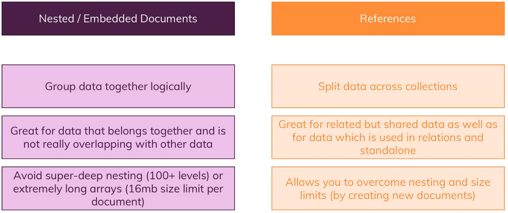

== Utilisation de `lookUp()` pour fusionner les relations avec références   

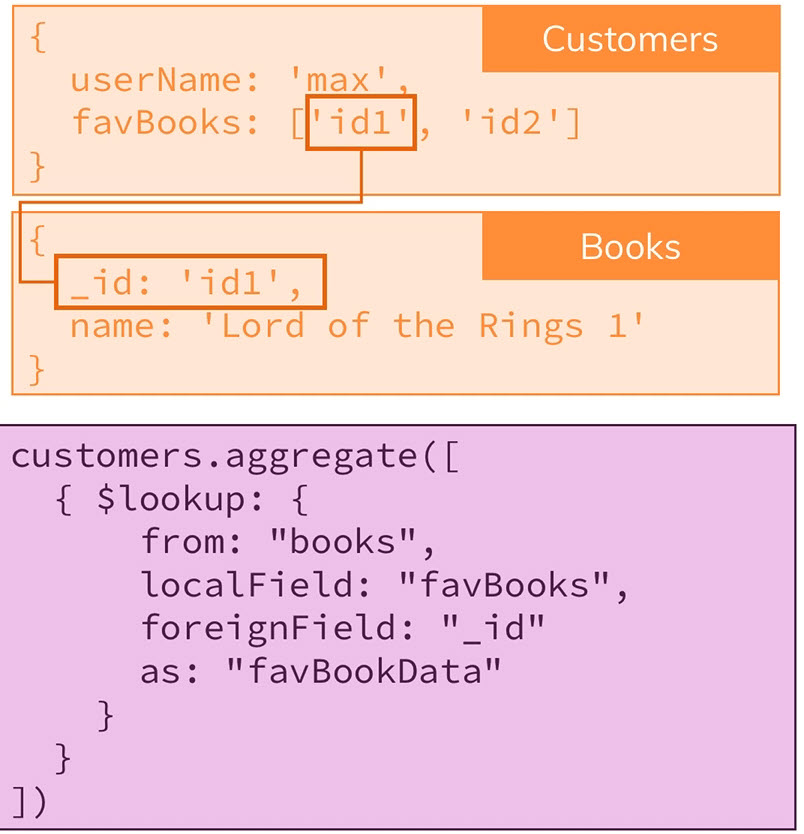

C'est un excellent outil pour fusionner des données en une seule étape. 

[source, javascript]
----
db.books.aggregate([{$lookup: {from: "authors"<1> , localField: "authors"<2>, foreignField: "_id"<3>, as: "creators"<4>}}])
---- 

<1>De quelle autre collection souhaitons nous lier le document? (authors)

<2>Où stockons nous les références à la collection étrangère dans notre document en cours ? (authors)

<3>Quel champ est la clé dans la collection cible ? 

<4>Quel sera le nom du champ qui contiendra les nouvelles données ? 

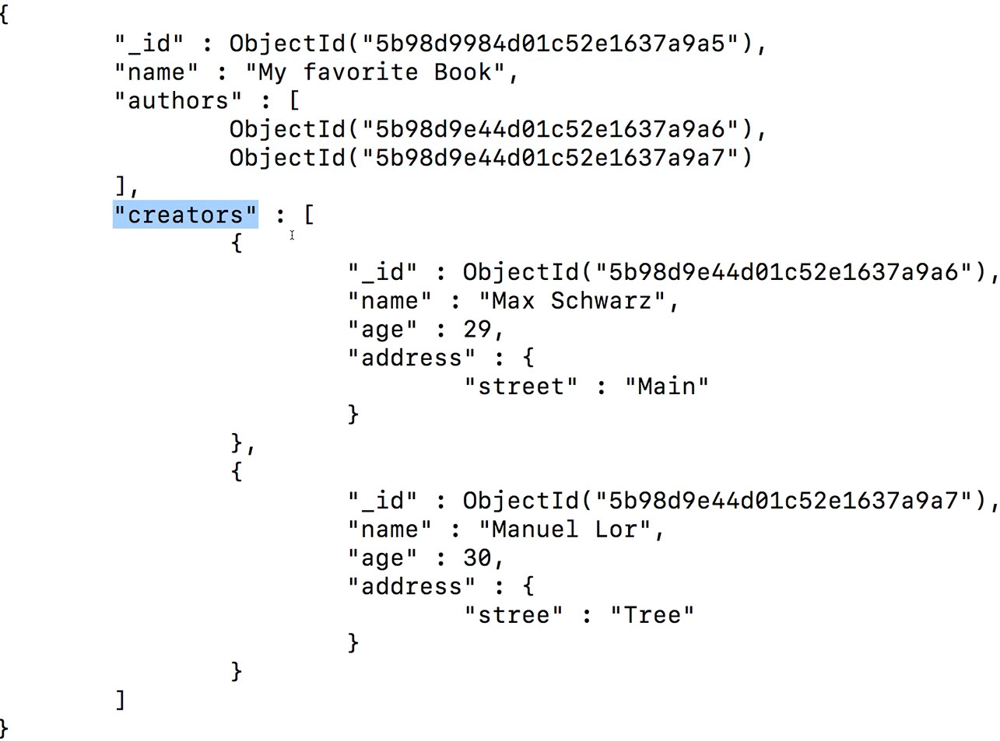

== Exemple de Projet : Un Blog.

A partir de la logique applicative que nous souhaitons. Définissons le schéma et les relations entre nos entités de notre base de données MongoDB. 

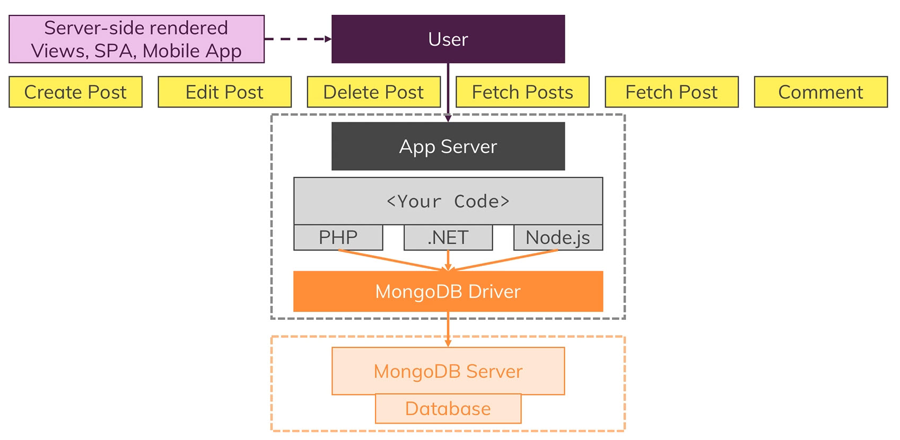

Il n'y a pas qu'une seule solution.

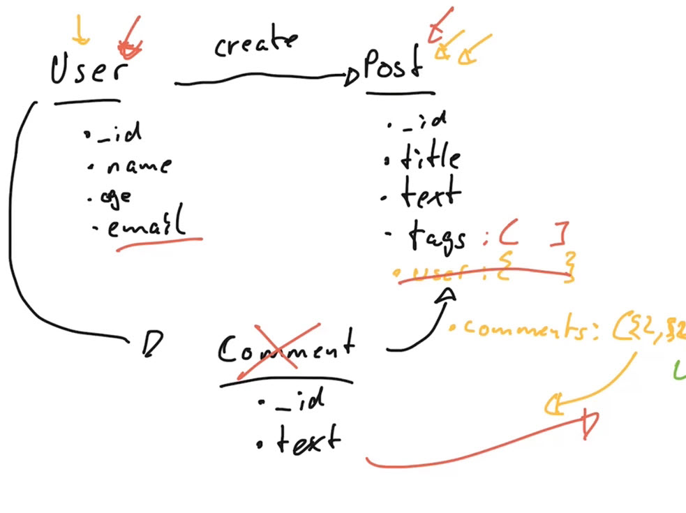

== Implémentation du projet : Blog avec le Shell.

[source, ]
----
use blog
db.users.insertMany(
  [
    {name: "Baptiste Bauer", age: 39, email: "bbauer02@gmail.com"},
    {name: "John Doe", age: 30, email: "john.doe@gmail.com"}
  ])
----

Réponse : 

[source, ]
----
{
  acknowledged: true,
  insertedIds: {
    '0': ObjectId("62af8ea91e1695f1d3ef48f9"),
    '1': ObjectId("62af8ea91e1695f1d3ef48fa")
  }
}
----

[source, ]
----
db.posts.insertOne(
  {title: "My First Post!!", text: "This is my first post, i hope you will like it!!", tags: ["new", "tech"], creator: ObjectId("62af8ea91e1695f1d3ef48fa"), comments: [{text: "This is a comment !!", author: ObjectId("62af8ea91e1695f1d3ef48f9")}]}
)
----

Réponse : 

[source, ]
----
{
  acknowledged: true,
  insertedId: ObjectId("62af8f741e1695f1d3ef48fb")
}
----

Affichons un `posts` avec `db.posts.findOne()`

[source, ]
----
{
  _id: ObjectId("62af8f741e1695f1d3ef48fb"),
  title: 'My First Post!!',
  text: 'This is my first post, i hope you will like it!!',
  tags: [ 'new', 'tech' ],
  creator: ObjectId("62af8ea91e1695f1d3ef48fa"),
  comments: [
    {
      text: 'This is a comment !!',
      author: ObjectId("62af8ea91e1695f1d3ef48f9")
    }
  ]
}
----

== Schema Validation 

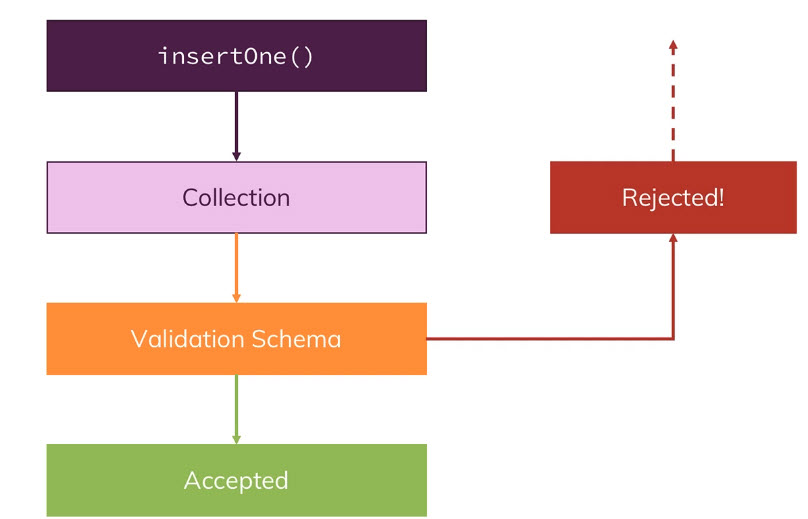

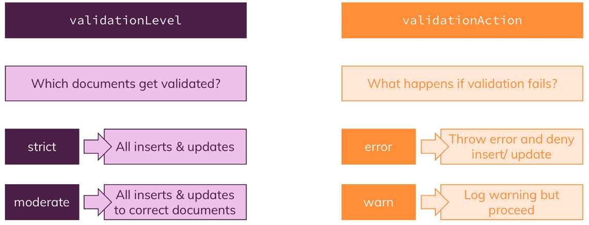

Comment ajouter une validation dans MongoDB ? 

On peut le faire facilement à la création d'une collection.

Supprimons la collection `posts`
[source, ]
----
db.posts.drop()
----

Maintenant créons la différement : 

[source,javascript]
----
db.createCollection("posts", {
  validator: {
    $jsonSchema: {
      bsonType: "object",
       required:["title", "text", "creator", "comments"], 
       properties: {
        title: {
          bsonType: "string",
          description: "must be a string and is required"
        }, 
        text: {
          bsonType: "string",
          description: "must be a string and is required"
        },
        creator: {
          bsonType: "objectId",
          description: "must be a objectId and is required"
        },
        comments : { 
          bsonType: "array",
          description: "must be a array and is required", 
          items: {
            bsonType: "object",
            required: ["text", "author"],
            properties: {
              text: { 
                bsonType: "string", 
                description: "must be a string and is required"
              },
              author: {
                bsonType: "objectId", 
                description: "must be a objectId and is required"
              }
            }
          }
        }
       }
    }
  }
})
----

== Modifier l'action un Schema Validation 

[source,javascript]
----
db.runCommand({collMod: "posts",  validator: {
    $jsonSchema: {
      bsonType: "object",
       required:["title", "text", "creator", "comments"], 
       properties: {
        title: {
          bsonType: "string",
          description: "must be a string and is required"
        }, 
        text: {
          bsonType: "string",
          description: "must be a string and is required"
        },
        creator: {
          bsonType: "objectId",
          description: "must be a objectId and is required"
        },
        comments : { 
          bsonType: "array",
          description: "must be a array and is required", 
          items: {
            bsonType: "object",
            required: ["text", "author"],
            properties: {
              text: { 
                bsonType: "string", 
                description: "must be a string and is required"
              },
              author: {
                bsonType: "objectId", 
                description: "must be a objectId and is required"
              }
            }
          }
        }
       }
    }
  },
  
  validationAction: 'warn' 
  
  })
----

Exécutons ce code et relançons la commande qui doit générer une erreur.
Nous constatons qu'elle a fonctionné ! car nous avons modifié le schema validator pour qu'il ne génére plus d'exception mais des avertissements. 

Le message d'erreur sera dans les logs. 

== Les choses à considérer quand nous structurons notre modèle de données. 

* Quel format sera parcouru ? 
* Allez vous parcourir ou modifier souvent ces données ? 
* Quel volume les données vont occuper?
* Quels sont vos relations entre les données ? 
* La duplication est-elle coûteuse ( en mise à jour) ?
* Risquons nous d'atteindre la limite de taille d'un document ?

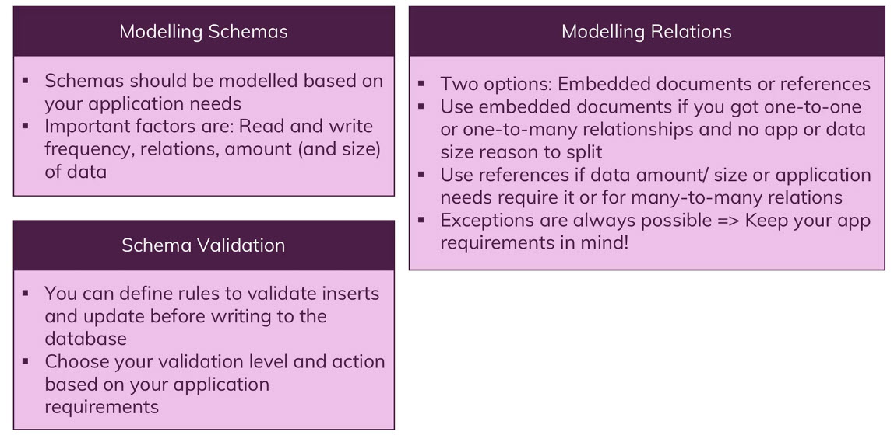

== Exercice : notion de jointure

Créez une nouvelle base de données bookstore.

Créez une collection categories et une collection books :

* categories

[,json]
----
const categories = 
[
    { name : "Programmation"},
    { name : "SQL"},
    { name : "NoSQL"}
];
----

* books

[,json]
----
const books = [
   { title : "Python" }, // programmation
   { title : "JS" }, // programmation
   { title : "PosgreSQL" }, // SQL
   { title : "MySQL" }, // SQL
   { title : "MongoDB" } // NoSQL
]
----

. Faites un script JS afin d'associer chaque livre à sa catégorie en utilisant l'id de sa catégorie. Créez une propriété category_id dans la collection books.
. Puis faites une requête pour récupérer les livres dans la catégorie programmation.
. Combien de livre y a t il dans la catégorie NoSQL ?
. Associez maintenant les livres ci-dessous aux catégories :

[,json]
----
const newBooks = [
    { title : "Python & SQL"}, // Python & SQL
    { title : "JS SQL ou NoSQL" }, // programmation
    { title : "Pandas & SQL & NoSQL"}, // SQL, NoSQL et Python
    { title : "Modélisation des données"} // aucune catégorie
]
----

. Récupérez tous les livres qui n'ont pas de catégorie

La création d'un index sur le document permettra une recherche plus rapide sur le champ indexé. Un index est comme un index de livre il permet à MongoDB d'aller plus vite dans la recherche d'une information donnée.

== Exercice tree structure Algorithmique recherche

Dans la base de données bookstore.

Créez la collection categoriestree contenant les documents suivants :
[,json]
----
[
   {
      _id: "Books",
      parent: null,
      name: "Informatique"
   },
   {
      _id: "Programming",
      parent: "Books",
      books: [
            "Python apprendre",
            "Pandas & Python",
            "async/await JS & Python",
            "JS paradigme objet",
            "Anaconda"
      ]
   },
   {
      _id: "Database",
      parent: "Programming",
      books: [
            "NoSQL & devenir expert avec la console",
            "NoSQL drivers",
            "SQL"
      ]
   },
   {
      _id: "MongoDB",
      parent: "Database",
      books: [
            "Introduction à MongoDB",
            "MongoDB aggrégation"
      ]
   }
];
----

Créez un index sur la clé parent pour accélerer la recherche :

[,json]
----
db.categoriestree.createIndex( { parent: 1 } );
----

== Exercice

Écrire un algorithme qui ajoute une propriété ``ancestors`` à la collection afin d'énumérer les catégories parentes. Vous utiliserez l'opérateur addToSet pour ajouter le/les parent(s) de chaque document.

Par exemple la catégorie MongoDB aurait la propriété ``ancestors`` suivante :

[,json]
----
db.categoriestree.find(
   { _id : "MongoDB" },
   { ancestors : 1 }
);

/*
Doit afficher :
   {
      "_id" : "MongoDB",
      "ancestors" : [
         { "_id" : "Database" },
         { "_id" : "Programming" },
         { "_id" : "Books" }
      ]
   }
*/
----