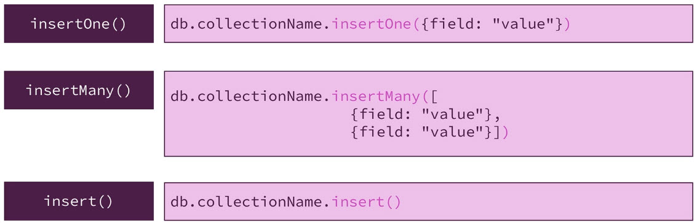
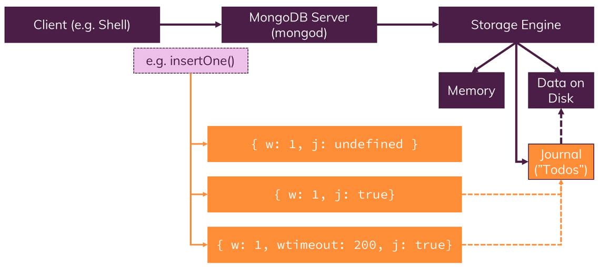
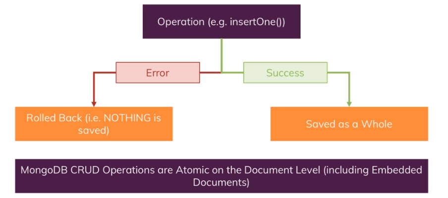

= CREATE en profondeur

Nous avons déjà eu un aperçu de base des fonctionnalités qui nous permettent d'ajouter des documents dans une collection. 

Nous allons ici étudier plus en détail comment créer des documents, comment importer des Documents. 

== CREATE Documents

Nous connaissons déjà 2 méthodes : 
``insertOne()`` et ``insertMany()``.
Ajoutons à nos outils : `insert()` qui accepte en argument, soit un Document ou un tableau de Documents. 

Toutefois, lorsque nous utilisons `insert()` il faut être claire sur nos intentions : souhaitons nous ajouter une entrée ou plusieurs ! et cela peu être propice à des erreurs. 

C'est pour cela qu'il vaut mieux utiliser soit `insertOne` ou `insertMany` pour qu'il y ait moins d'ambiguité. 

Pour importer des données en masse à partir d'un fichier nous pouvons utiliser : 

`mongoimport -d cars -c carsList --drop --jsonArray` 

== Comprendre les méthodes `insert()`

[source, javascript]
----
use contactData
db.persons.insertOne({name:"Max", age:30, hobbies: ["Sports", "Cooking"]})
db.persons.insertOne({name:"Manuel", age:31, hobbies: ["Cars", "Cooking"]})
db.persons.insertMany([{name:"Max", age:30, hobbies: ["Sports", "Cooking"]}, {name:"Manuel", age:31, hobbies: ["Cars", "Cooking"]}])

db.persons.insert({name:"Max", age:30, hobbies: ["Sports", "Cooking"]})

----

Lorsque l'on utilise `insert` pour saisir des Documents, on constate qu'il ne retourne pas les ``_id`` générés automatiquement. Ce qui est un inconvénient majeur parce que l'on développe une application qui ajoute des documents, on souhaite dans le même temps récupérer l'identifiant créé pour notre application. ( front end ..etc)

== Insertions ordonnées ou pas

[source, javascript]
----
  db.hobbies.insertMany([{name: "Sports"}, {name: "Cooking"}, {name: "Horses Riding"}, {name: "Cars"}])
----

En effectuant cette insertion, automatiquement nous allons recevoir pour chacun des hobbies, un identifiant unique. 
Nous pouvons utiliser nos propres identifiants bien entendu ! 

[source, javascript]
----
  db.hobbies.insertMany([{_id: "sports", name: "Sports"}, {_id:"cooking", name: "Cooking"}, {_id:"horses",name: "Horses Riding"}, {_id:"cars",name: "Cars"}])
----

Cette façon de faire est correcte et permet d'avoir nos propres identifiants ! mais répétons l'opération  en ajoutant de nouveaux hobbies, dont un avec un identifiant déjà pris ! 

[source, javascript]
----
  db.hobbies.insertMany([{_id: "yoga", name: "Yoga"}, {_id:"cooking", name: "Cooking"}, {_id:"hiking",name: "Hiking"}])
----

Sans surprise ! nous allons obtenir une erreur !
Regardons le message d'erreur : "Duplicate key error collection". 

Nous lisons également qu'il y a eu un seul élément d'inséré : Yoga !  
MongoDb insére le premier élément, puis arrive le message d'erreur sur le deuxième. MongoDb ne retourne donc pas en arrière pour annuler la précédente insertion. 

Si l'on répéte encore une fois l'opération, l'erreur se produira sur le premier élément. 

Pour pallier à cela, nous pouvons ajouter un ordre d'insertion. 

[source, javascript]
----
  db.hobbies.insertMany([{_id: "yoga", name: "Yoga"}, {_id:"cooking", name: "Cooking"}, {_id:"hiking",name: "Hiking"}], {ordered: false})
----

L'insertion ne s'arrête plus sur l'élément qui génére une erreur. 

== Comprendre : WriteConcern

Voici une deuxième option d'insertion : `WriteConcern`.

Nous avons vu les insertions ordonnées et non ordonnées, maintenant il y a une deuxième option que nous pouvons spécifier sur ``insertOone`` et ``insertMany`` et qui est l'option `WriteConcern`.

Nous avons un client et nous avons notre serveur mongodb, le client serait le shell ou votre application utilisant un pilote ``mongodb``, le serveur mongodb, l'exécutable ``mongod``.

Supposons maintenant que vous souhaitiez insérer un document.
Nous avons le `Storage engine`, c'est le moteur qui est vraiment responsable de l'écriture de nos données sur le disque et qui gére la mémoire.

La donnée à écrire peut d'abord se retrouver dans la mémoire pour diverses opération, car c'est plus rapide que de travailler avec le disque.

Bien sûr, la donnée finira par se retrouver sur le disque.

Vous pouvez configurer un paramètre `writeConcern` dans notre insertion, en ajoutant un objet comprenant cette définition : 

`{w:1, j: undefined}`

ou

`{w:1, j: true}`

ou 

`{w:1, j: true, wtimeout:200}`

qu'est-ce que cela signifie?

Le ``w`` signifie simplement "écrire"

et

le nombre ici indique le nombre d'instances, au cas où vous utilisez plusieurs instances sur un serveur, c'est aussi quelque chose que nous couvrirons vers la fin du cours, alors ignorons-le pour l'instant.

Dans combien d'instances voulez-vous que ce document soit reconnue? 
Avec ``{w:1}`` qui est la valeur par défaut, vous dites essentiellement que le serveur mongodb doit accepter cette écriture, donc le moteur de stockage finira par l'écrire sur le disque. 

Le `j` signifie le journal.

Le journal est un fichier supplémentaire géré par le moteur de stockage qui est comme un fichier To-Do.
Le journal peut être conservé pour, par exemple, sauvegarder les opérations que le moteur de stockage doit effectuer et qui ne sont pas encore terminées, comme l'écriture. 

Maintenant, le Storage Engine est au courant de l'ordre d'écriture et sait qu'il doit stocker ces données sur le disque.

L'idée de ce fichier journal, qui est un vrai fichier sur le disque, est de pouvoir anticiper le cas où le serveur tomberait en panne, ou devrait soudainement s'arrêter.
En redémarrant, il y a une trace des actions à réaliser, et qui n'ont pas été réalisées.

Car la mémoire, elle, est vidée en cas de redémarrage, donc, votre écriture pourrait être perdue si elle n'est pas écrite dans le journal.

Maintenant, la question est de savoir pourquoi l'écrivons-nous dans le journal et non directement dans les fichiers de la base de données? 
Parce que écrire directement dans les fichiers de la base de données est gourmand en performance, le journal, lui, est juste une simple ligne qui décris l'opération d'écriture.

Ecrire dans les fichiers de la base est une tâche complexe parce que nous avons besoin de trouver la bonne position où insérer la donnée, si vous avez des indexs, nous aurons besoin de les mettre à jour également.

Ajouter la tâche dans un journal est donc plus rapide. 

Avec l'option ``{j:undefined}``, le journal n'est pas utilisé, cela signifie que le storage engine doit éventuellement gérer l'écriture mais nous n'avons pas encore cette information, et nous ne savons pas si cela a été stocké dans le journal. Nous n'avons aucune information. 

Donc si ke serveur doit s'arrêt, il est possible que l'écriture n'ait pas eu lieu, parce qu'elle n'a pas été inscrite dans le journal, et n'a pas été sauvegardé dans le disque. 

Alors, vous pouvez mettre `j` à `true`, ce qui veut dire que vous souhaitez être informé du succès de l'écriture après que cela ait été réalisé dans le journal. Cela ajoute de la sécurité. 

Il existe une autre option, qui n'a rien à voir avec le journal : {w}, l'option wtimeout.
Cela permet d'indiquer quelle période de temps nous accordons au serveur pour rapporter un succès de l'écriture avant d'annuler l'ordre. 

Ainsi, s'il y a des problèmes avec la connexion, nous aurons un timeout et nous saurons que la donnée n'a pas été inscrite. 

== WriteConcern par la pratique.

Jouons un peu avec le "WriteConcern".

[source, javascript]
----
db.persons.find({});
db.persons.insertOne({name: "Chrissy", age: 41}, {writeConcern: {w:0}})
----

Si l'on ajoute un writeConcern avec un champ w à false. Nous aurons un acknowledged à false. Mais la donnée sera ajoutée quand même.
La donnée est ajouté rapidement, car nous n'avons pas besoin d'attendre un acknowledge du serveur et il n'y a pas d'_id de retourné par le serveur. 

Mais nous ne savons pas si c'était un succès ou pas. C'est utile par exemple si nous loggons toutes les secondes des données et qu'importe peu s'il y a des pertes. 
La valeur par défaut est w: 1.

[source, javascript]
----
db.persons.insertOne({name: "Michael", age: 41}, {writeConcern: {w:1}, j: false})
----

En exécutant cette requête nous ne voyons aucune information en plus.

[source, javascript]
----
db.persons.insertOne({name: "Michaela", age: 41}, {writeConcern: {w:1}, j: true})
----

Le message de retour n'a pas changé dans la console. Et tout c'est exécuté treès rapidement car nous sommes en local et que le journal n'est pas volumineux. 

Mais toutefois, nous savons que nous avons gagné en sécurité dans l'insertion de nos données. 
Qu'avant de recevoir un acknowledge du serveur, nous avons eu une écriture de l'ordre d'insertion de la donnée dans le journal et que cet ordre a ensuite été suivis par une écriture en mémoire et sur le disque. 

[source, javascript]
----
db.persons.insertOne({name: "Aliya", age: 41}, {writeConcern: {w:1}, j: true, wtimeout:200})
----

Cela rajoute un temps maximum d'exécution. 

== Atomicity

MongoDb assure l'Atomicité du CRUD. 
C'est à dire les données que l'on Insère/Supprime/Modifie, le sont uniquement si l'intégralité du document a pu subir l'opération.

Si le serveur faillit durant le processus et que l'un des champs ne peut pas subir l'opération alors, c'est l'opération sur tout le document qui est annulée. 

== Tâches à accomplir : 

* Insérer des entreprises dans une collection d'entreprise avec insertOne et insertMany.
* Insérer une entreprise avec une clé _id déjà existante délibérement et "résolvez" le problème avec une insertion désordonnée. 
* Ajouter des données avec : le journalisation d'activé et non activé. 

== Importer des données

[source, javascript]
----
mongoimport <FILE PATH> -d <dataBaseName> -c <collectionName> --jsonArray --drop
----

