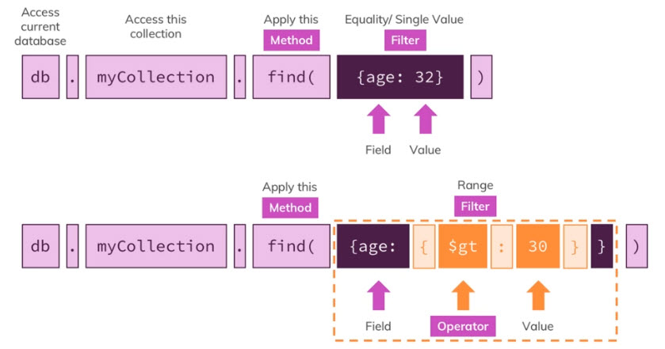
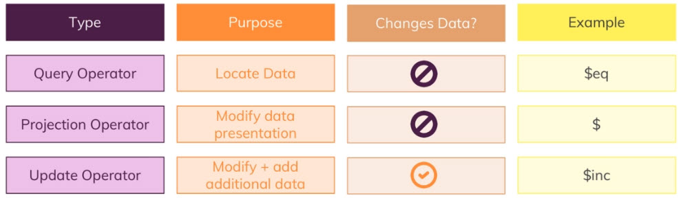
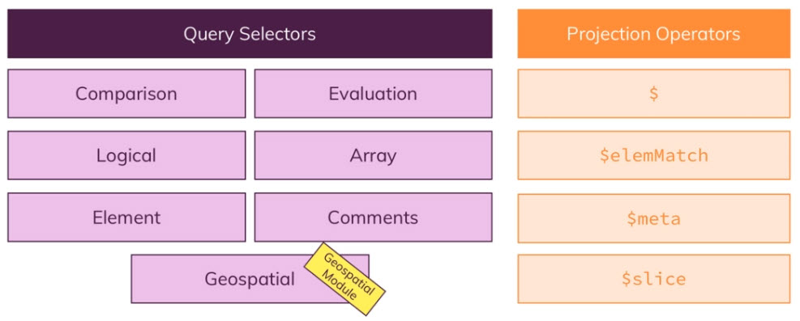

= READ en profondeur

* Dans cette section nous allons voir plus en profondeur les méthodes, les filtres et les opérateurs. 

* Les requêtes permettant d'effectuer des lectures de données. 

* Les Opérateurs permettant de faire des projections. 

Avant d'étudier ce module, il faudra importer la collection `04-tv-shows.json`

== Méthodes, filtres et opérateurs

=== Opérateurs READ

Comment les opérateurs impactent nos données ? 

* `findOne()` : Qui renvoie toujours le premier document qui match avec le filtre. 

[,]
----
db.movies.findOne({})
----

* `find()` : Qui renvoie l'ensemble des documents qui match avec le filtre.

[,]
----
db.movies.find({})
----

=== Opérateurs de comparaison

[,]
----
db.movies.find({ runtime: 60 })
----

Equivaut à 

[,]
----
db.movies.find({ runtime: {$eq: 60} })
----

L'opposé, "différent de" : 

[,]
----
db.movies.find({ runtime: {$ne: 60} })
----

https://www.mongodb.com/docs/manual/reference/operator/query/[Liste des opérateurs]

=== Requête sur des documents embarqués ou tableaux

* Les documents embarqués

Les films dont la note moyenne est supérieur à 7.0.
[,]
----
db.movies.find({"rating.average": {$gt: 7.0 }})
----

* Les tableaux

Les films dont l'un ou le genre est "Drama", sachant que Drama est un tableau de chaine de caractère.
[,]
----
db.movies.find({"genres: "Drama"})
----

Cela va sélectionner tout les films dont le tableau de genre contient "Drama".

Si nous souhaitons avoir un seul genre, et qu'il soit exactement et seulement "Drama" : 

[,]
----
db.movies.find({"genres: ["Drama"]})
----

=== Comprendre `$in` et `$nin`

Si nous souhaitons que le champ "runtime" soit égal à 30 ou à 42 : 

[,]
----
db.movies.find({"runtime: {$in: [30,42]}})
----

Si nous souhaitons que le champ "runtime" ne soit pas égal à 30 ou à 42 : 

[,]
----
db.movies.find({"runtime: {$nin: [30,42]}})
----

=== Comprendre `$or` et `$nor`

Les films dont la note est comprise entre 3 et 9

[,]
----
db.movies.find({$or: [{"rating.average": {$gte:3}}, {"rating.average": {$lte:9}}]})
----

Les films dont la note n'est pas comprise entre 3 et 9

[,]
----
db.movies.find({$nor: [{"rating.average": {$gte:3}}, {"rating.average": {$lte:9}}]})
----

=== Comprendre `$and` 

Les films dont la note est supérieure ou égale à 9, et  le genre est "Drama"

[,]
----
db.movies.find({$and: [{"rating.average": {$gte:3}}, {genre: "Drama"}]})
----

=== Comprendre `$not` 

Inverse le résultat d'une requête.

[,]
----
db.movies.find({runtime:{$not: {$eq;60}}})
----

=== Opérators sur les champs  

On veut tester si un champ existe dans un document, et sélectionner les documents qui possède ce champ et dont la valeur est plus grande que 30

[,]
----
db.user.find({age:{$exists: true, $gt:30}})
----

On veut tester si un champ n'est pas null. C'est à dire possède une valeur.

[,]
----
db.user.find({age:{$exists: true, $ne: null}})
----

=== Travailler avec $type 

Sélectionner les documents dont le champ "phone" est de type "double" ou "string"

[,]
----
db.user.find({phone:{$type: ["double", "string"]}})
----

=== Travailler avec $regex 

Sélectionner les films dont le synopsis contient le terme "musical"

[,]
----
db.movies.find({summary:{$regex: /musical/}})
----

=== Travailler avec $expr 

Permet de comparer 2 champs dans un document.

Par exemple dans des transactions financières : 

[,]
----
db.sales.insertMany([{volume:100, target:120}, {volume:89, target:80}, {volume:200, target:177}])
----

Faire une comparaison entre les valeurs de deux champs 

[,]
----
db.sales.find({$expr:{$gt:["volume", "target"]}})
----

D'un point de vue alphabétique ici, le comparatif est vrai. Il faudra alors préciser. Il faudra rajouter un "$" devant le nom du champ pour être certain de comparer avec la valeur. 

[,]
----
db.sales.find({$expr:{$gt:["$volume", "$target"]}})
----

[,]
----
db.sales.find({$expr:{$gt:[ {
  $cond: {if: {$gte: ["$volume", 190]}, then: {$substract:["$volume", 10]}, else:"$volume"}
}, "$target"]}})
----

=== Exercice

* Import les données du fichier `05-boxoffice.json` 
* Recherchez tout les films qui ont une note (rating) supérieur à 9.2 et une durée inférieur à 100 minutes.
* Recherchez les films qui ont pour genre : "Drama" et "Action"
* Recherchez les films dont le nombre d'entrées a dépassé les pronostoques. (champs : visitors et exceededVisitors)